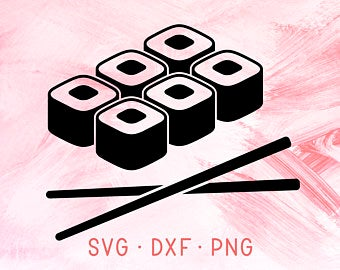

# Suchi-ocean-Project
**Project:Sushi**

*Projekt Sushi-ocean stworzony za pomoca:*

1. HTML
2. CSS
3. jQuery

*Strony pomocnicze*

* https://ionicons.com/
* https://jqueryui.com/
* https://dimsemenov.com/plugins/magnific-popup/
* https://www.heteroclito.fr/modules/tooltipster/
* https://steven.codes/typerjs/
* https://animate.style/

## Header 
*Header zawiera zdjecia:*

1. logo



2. header-background


*Button*

Za pomoca button w header, po kliknienczu, mamy mozliwosc dotrzec do innych _section_ 

*Main-nav*

Class **Main-nav** ma trzy postaci:

1.   

```
#main-nav {
  float: right;
  list-style: none;
  font-size: 1.3em;
}

#main-nav li {
  display: inline-block;
  margin-right: 30px;
}
```

2. 
```
#main-nav li a:link,
#main-nav li a:visited {
  text-decoration: none;
  text-transform: uppercase;
  color: #fee4e8;
  letter-spacing: 8px;
  opacity: 0.5;
}

#main-nav li a:hover,
#main-nav li a:active {
  border-radius: 30%;
  opacity: 1;
}
```

3.

```
#sticky-nav #main-nav li a:hover,
#sticky-nav #main-nav li a:active {
  background: #f17c8e;
  border-radius: 30%;
  opacity: 1;
  border-bottom: 2px solid #fee4e8;
  transition: 0.3s;
}

#sticky-nav .mobile-nav-icon i {
  color: #f17c8e;
  position: fixed;
  top: 0;
  right: 0;
  margin-right: 20px;
  margin-top: 10px;
}
```


## Section Restaurant-dexcription

*Zawiera **tekst**,  **icon** [ionicons](https://ionicons.com/) oraz **anim1***

```
.anim1,
.anim2,
.anim3 {
  opacity: 0;
}

.anim1.animated,
.anim2.animated,
.anim3.anmated {
  opacity: 1;
}
```

## Section Food-images-section

*Sekcja z image*
```
.food-image img {
  opacity: 0.7;
  width: 100%;
  height: auto;
  -webkit-transform: scale(1.2);
  -ms-transform: scale(1.2);
  transform: scale(1.2);
  -webkit-transition: -webkit-transform 1s;
  transition: -webkit-transform 1s;
  -o-transition: transform 1s;
  transition: transform 1s;
  transition: transform 1s, -webkit-transform 1s;
}

.food-image img:hover {
  opacity: 1;
  -webkit-transform: scale(1.05);
  -ms-transform: scale(1.05);
  transform: scale(1.05);
}
```

## Section Cities-section

*Zawiera **anim2** animacje, linki do image oraz tekst*

## Section Feedback-secrion
background
```
#feedback-section {
  background-image: -o-linear-gradient(rgba(0, 0, 0, 0.7), rgba(0, 0, 0, 0.7)),
    url(../images/sushi-123.jpg);
  background-image: -webkit-gradient(
      linear,
      left top,
      left bottom,
      from(rgba(0, 0, 0, 0.7)),
      to(rgba(0, 0, 0, 0.7))
    ),
    url(../images/sushi-123.jpg);
  background-image: linear-gradient(rgba(0, 0, 0, 0.7), rgba(0, 0, 0, 0.7)),
    url(../images/sushi-123.jpg);
  background-size: cover;
  color: #fff;
  background-attachment: fixed;
}
```
+
tekst

## Section Contact-form-section

Tabela **input**

## Footer-nav
**icon**, backbround, tekst

## jQuery

Urzywamy przy zmianie headera na section **Resraurant-description**, przy nawigacji, animacji

```
$(document).ready(function () {
  //sticky-nav
  var waypoint = new Waypoint({
    element: document.getElementById("restaurant-description"),
    handler: function (direction) {
      if (direction == "down") {
        $("nav").attr("id", "sticky-nav");
      } else {
        $("nav").removeAttr("id");
      }
    },
    offset: 100,
  });
  
  
  
  ```
  
  


